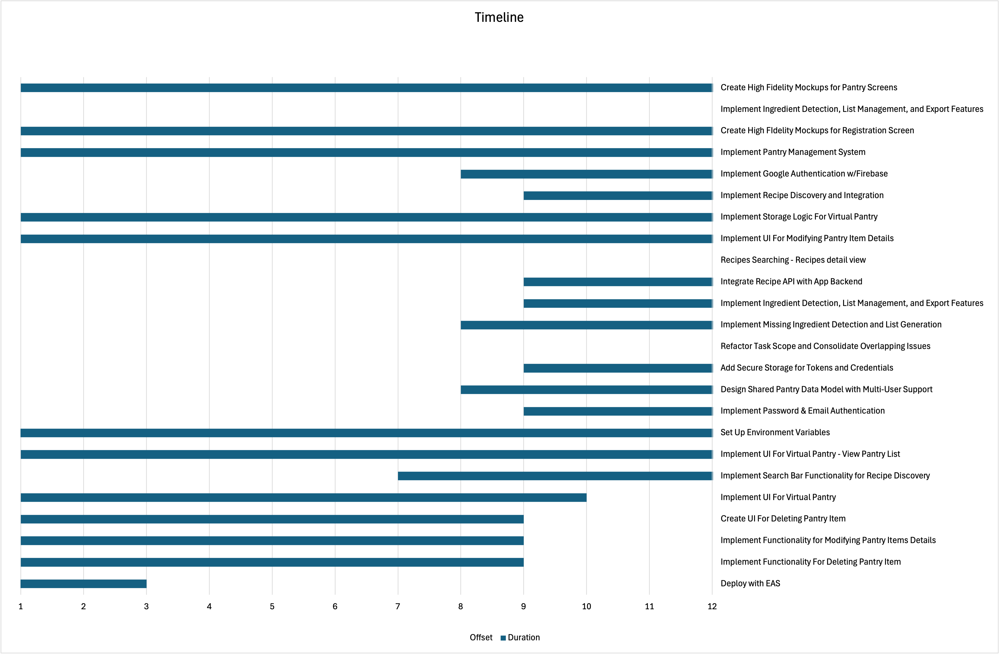

Repo Link: https://github.com/AzureVauban/Food-Pantry-App

## Group Members

| Michael Elder  | Project Manager/Virtual Pantry/Collaborative Pantry |
| -------------- | --------------------------------------------------- |
| Ali Jalil      | Virtual Pantry/Recipe Searching                     |
| Rene Sanchez   | Virtual Pantry                                      |
| Ethan Perez    | Authentication (Web)                                |
| Martin Mendoza | Grocery List Generator                              |

---

## Project Progress Since Status Report

- Rene completed the base logic and interface components for the Virtual Pantry, integrating item tracking and synchronization with local storage and Firestore.
- Ali implemented the Recipe Search Functionality using the FatSecret API and connected it with the pantry data system, allowing users to cross-reference pantry items with recipe requirements.
- Ethan completed the Google Authentication system for web, ensuring proper session persistence and logout redirection. He also resolved a bug where the authentication session was lost on page refresh.
- Michael refactored and consolidated major tasks across the repository to clarify project scope and eliminate overlap between team members. The API integration issues in `pantryview` were originally assigned to him but proved to be complex, leading Rene and Ali to assist in resolving the issue and refactoring the affected code. Together, they reorganized the project to maintain a consistent structure and naming convention.
- Martin continues development on the Grocery List Generator, focusing on integrating it with recipe data to dynamically populate missing ingredients.
- The team jointly integrated the Recipe Search UI and ensured smooth backend interaction between the Recipe and Pantry Systems.

| Completed Features | Features Still in Progress |
| :--------------------------------------------------------------------- | :----------------------------------------------------------------------------- |
| Google OAuth on Web                                                    | Polished (High Fidelity) UI                                                    |
| Recipe Searching                                                       | Grocery List Generation                                                        |
| Pantry Creation and Implementation                                     | Collaborative Pantry                                                           |

---

- Seamless integration between the Pantry Inventory System and Recipe Discovery Flow, enabling dynamic ingredient comparison.
- Consistent code formatting and repository refactoring improved maintainability and developer collaboration.
- Enhanced project management structure, ensuring clearer task ownership, dependency mapping, and reduced overlap during feature development.

---

## Next Steps

- Complete and finalize the Grocery List Generator and ensure its integration with recipe and pantry data.
- Conduct final bug fixes and UI polish for the web platform.
- Prepare the system for final testing and documentation, including a walkthrough of core user flows such as pantry management, recipe search, and grocery list creation.
- If time permits, the team will revisit the mobile implementation of the app as a stretch goal. The current priority remains ensuring complete functionality and stability on the web platform.
